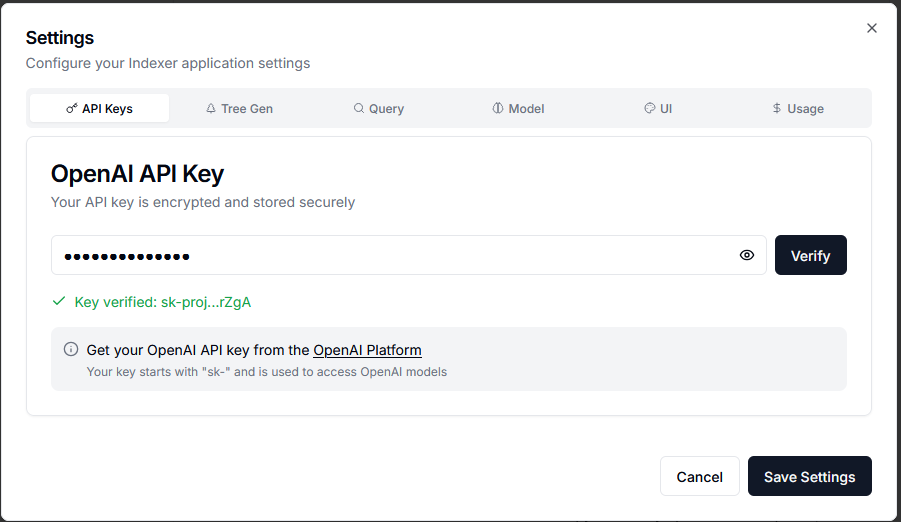

# Indexer - Microservice RAG System

A production-ready, reasoning-based RAG (Retrieval-Augmented Generation) system built with microservice architecture. Implements PageIndex's vectorless approach for accurate document querying with 98.7% retrieval accuracy.

## Technology Stack

### Frontend Technologies


### Backend Technologies


### Infrastructure


## Architecture Overview

This project implements a 9-microservice architecture, where each service has a single responsibility and communicates through a centralized API gateway.

### Service Architecture Diagram

```
                    ┌─────────────────────────────────────────┐
                    │         USER INTERFACE LAYER            │
                    │    Next.js Frontend (Port 3000)         │
                    │    React + TypeScript + WebSocket       │
                    └───────────────────┬─────────────────────┘
                                        │
                                        │ REST API & WebSocket
                                        │
                    ┌───────────────────▼─────────────────────┐
                    │       API GATEWAY (Port 8000)           │
                    │   FastAPI - Routes & Orchestration      │
                    └────────────────────┬────────────────────┘
                                         │                      
            ┌────────────┬─────────┬─────┴───┬───────────┬───────────┬──────────┐
            │            │         │         │           │           │          │
            ▼            ▼         ▼         ▼           ▼           ▼          ▼
     ┌──────────┐ ┌──────────┐ ┌────────┐ ┌────────┐ ┌────────┐ ┌────────┐ ┌────────┐
     │ Document │ │   Tree   │ │ Query  │ │  Chat  │ │Storage │ │ Cache  │ │Settings│
     │ Service  │ │ Service  │ │Service │ │Service │ │Service │ │Service │ │Service │
     │  :8001   │ │  :8002   │ │ :8003  │ │ :8004  │ │ :8005  │ │ :8006  │ │ :8007  │
     │          │ │          │ │        │ │        │ │        │ │        │ │        │
     │ PDF      │ │PageIndex │ │2-Stage │ │WebSock │ │SQLite  │ │In-Mem  │ │API Key │
     │Processing│ │Tree Gen  │ │Retrieve│ │Real-tm │ │Persist │ │Cache   │ │ Mgmt   │
     └────┬─────┘ └────┬─────┘ └────┬───┘ └────────┘ └──────┬─┘ └────────┘ └────────┘
          │            │            │                       │
          │            │            │                       │
          │            └────────────┴───────────────────────┘
          │                         │                       │
          │                         │                       │
          │                         ▼                       ▼
          │              ┌─────────────────────┐  ┌──────────────────┐
          │              │    OpenAI API       │  │  Data Storage    │
          └─────────────▶│  - GPT-4 Turbo      │  │  - SQLite DB     │
                         │  - Tree Search      │  │  - Document Files│
                         │  - Answer Gen       │  │  - Conversations │
                         └─────────────────────┘  └──────────────────┘
```

### Microservices Breakdown

| Service              | Port | Responsibility                               | Key Technology                |
|----------------------|------|----------------------------------------------|-------------------------------|
| **Frontend**         | 3000 | User interface with real-time updates        | Next.js 14, React, TypeScript |
| **API Gateway**      | 8000 | Request routing and service orchestration    | FastAPI, async Python         |
| **Document Service** | 8001 | PDF upload, text extraction, page mapping    | FastAPI, PyPDF                |
| **Tree Service**     | 8002 | PageIndex tree generation, TOC detection     | FastAPI, OpenAI API           |
| **Query Service**    | 8003 | Two-stage retrieval, answer generation       | FastAPI, OpenAI, tiktoken     |
| **Chat Service**     | 8004 | WebSocket communication, real-time streaming | FastAPI, Socket.IO            |
| **Storage Service**  | 8005 | Document, tree, and conversation persistence | FastAPI, SQLite               |
| **Cache Service**    | 8006 | Query result caching with TTL                | FastAPI, in-memory cache      |
| **Settings Service** | 8007 | API key management, configuration storage    | FastAPI, encryption           |

### PageIndex Tree Generation Flow

```
PDF Document Upload
    │
    ▼
┌─────────────────────────────────────────────────────────────────┐
│ Step 1: Fetch Document & Settings (Tree Service)                │
│  1. Get document metadata from Storage Service                  │
│  2. Download PDF file bytes from Storage Service                │
│  3. Fetch tree generation config from Settings Service:         │
│     - model (default: gpt-4o-2024-11-20)                        │
│     - toc_check_page_num (default: 20)                          │
│     - max_page_num_each_node (default: 10)                      │
│     - max_token_num_each_node (default: 20,000)                 │
│     - if_add_node_id, if_add_node_summary, if_add_node_text     │
│  4. Retrieve encrypted OpenAI API key from Settings Service     │
│  5. Emit progress: "Starting tree generation..." (0%)           │
└─────────────────────────────────────────────────────────────────┘
    │
    ▼ {pdf_bytes, tree_config, api_key}
    │
┌─────────────────────────────────────────────────────────────────┐
│ Step 2: PDF Text Extraction (PageIndex Algorithm)               │
│  1. Use PyPDF2 to extract text from all pages                   │
│  2. For each page: count tokens using tiktoken                  │
│  3. Create page list: [(page_text, token_count), ...]           │
│  4. Emit progress: "Extracted N pages from PDF" (40%)           │
└─────────────────────────────────────────────────────────────────┘
    │
    ▼ page_list: [(text, tokens)] for each page
    │
┌─────────────────────────────────────────────────────────────────┐
│ Step 3: Table of Contents Detection                             │
│  1. Scan first N pages (toc_check_page_num, default: 20)        │
│  2. For each page: use GPT-4 to detect if it contains TOC       │
│  3. Find consecutive TOC pages until detection stops            │
│  4. Emit progress: "Detecting table of contents..." (45%)       │
│                                                                 │
│  If TOC Found:                                                  │
│    → Extract TOC content from detected pages                    │
│    → Check if TOC includes page numbers                         │
│    → If yes: Transform TOC to structured JSON with hierarchy    │
│    → If no: Analyze document to generate structure              │
│    → Emit: "Found TOC on N pages, extracting..." (50%)          │
│                                                                 │
│  If No TOC Found:                                               │
│    → Use process_no_toc() to generate structure from content    │
│    → Group pages into chunks respecting token limits            │
│    → Use GPT-4 to extract hierarchical structure from text      │
│    → Emit: "No TOC found, analyzing document..." (50%)          │
└─────────────────────────────────────────────────────────────────┘
    │
    ▼ toc_with_page_number: [{structure, title, physical_index}]
    │
┌─────────────────────────────────────────────────────────────────┐
│ Step 4: Structure Validation & Enhancement                      │
│  1. Add preface node if document doesn't start at page 1        │
│  2. Verify titles appear at page start (parallel GPT-4 calls):  │
│     - For each section: check if title appears at page begin    │
│     - Mark sections with 'appear_start': yes/no                 │
│  3. Filter valid items with physical_index                      │
│  4. Emit progress: "Verifying section titles..." (60%)          │
└─────────────────────────────────────────────────────────────────┘
    │
    ▼ valid_toc_items: validated structure with page mappings
    │
┌─────────────────────────────────────────────────────────────────┐
│ Step 5: Hierarchical Tree Building                              │
│  1. Post-process structure to calculate start/end indices:      │
│     - start_index = physical_index of section                   │
│     - end_index = physical_index of next section - 1            │
│  2. Convert flat list to nested tree using structure field:     │
│     - "1" → root node                                           │
│     - "1.1", "1.2" → children of "1"                            │
│     - "1.1.1" → child of "1.1"                                  │
│  3. Build parent-child relationships recursively                │
│  4. Emit progress: "Building tree from N sections..." (65%)     │
└─────────────────────────────────────────────────────────────────┘
    │
    ▼ toc_tree: [{title, start_index, end_index, nodes: [...]}]
    │
┌─────────────────────────────────────────────────────────────────┐
│ Step 6: Process Large Nodes Recursively                         │
│  1. For each node, check if it exceeds limits:                  │
│     - Pages > max_page_num_each_node (default: 10)              │
│     - Tokens > max_token_num_each_node (default: 20,000)        │
│  2. If large node found:                                        │
│     - Run process_no_toc() on node's page range                 │
│     - Generate sub-structure for this section                   │
│     - Add child nodes recursively                               │
│  3. Continue until all nodes meet size constraints              │
│  4. Emit progress: "Processing large sections..." (70%)         │
└─────────────────────────────────────────────────────────────────┘
    │
    ▼ toc_tree: refined with properly sized leaf nodes
    │
┌─────────────────────────────────────────────────────────────────┐
│ Step 7: Node Enhancement & Finalization                         │
│  1. Add unique node IDs (if if_add_node_id = true):             │
│     - Sequential IDs: "0000", "0001", "0002", etc.              │
│     - Emit: "Adding unique node identifiers..." (75%)           │
│                                                                 │
│  2. Add text content to nodes:                                  │
│     - if_add_node_text = true: full text per node               │
│     - if_add_node_text = false: text with <physical_index> tags │
│     - Emit: "Adding text content to nodes..." (78%)             │
│                                                                 │
│  3. Generate AI summaries (if if_add_node_summary = true):      │
│     - For each node: send text to GPT-4 for summary             │
│     - Add 100-200 word description to node metadata             │
│     - Emit: "Generating AI summaries..." (82%)                  │
└─────────────────────────────────────────────────────────────────┘
    │
    ▼ Complete Tree with metadata
    │
┌─────────────────────────────────────────────────────────────────┐
│ Step 8: Storage & Status Update (Tree Service)                  │
│  1. Count total nodes in tree structure recursively             │
│  2. Save tree JSON to Storage Service:                          │
│     {doc_id, tree_data, num_pages, num_nodes, config}           │
│  3. Emit progress: "Tree generated with N nodes" (80%)          │
│  4. Update document status to "indexed" in database             │
│  5. Emit progress: "Finalizing..." (95%)                        │
│  6. Emit completion event with tree_id (100%)                   │
└─────────────────────────────────────────────────────────────────┘
    │
    ▼
Complete PageIndex Tree Ready for Querying
{
  tree_id: int,
  doc_id: int,
  num_pages: int,
  num_nodes: int,
  tree: [
    {
      node_id: "0000",
      title: "Chapter 1: Introduction",
      start_index: 1,
      end_index: 15,
      text: "<physical_index_1>...</physical_index_1>...",
      summary?: "AI-generated summary...",
      nodes?: [
        {
          node_id: "0001",
          title: "1.1 Background",
          start_index: 1,
          end_index: 8,
          ...
        }
      ]
    }
  ],
  config: {model, max_page_num_each_node, ...},
  created_at: timestamp
}
```

### PageIndex Two-Stage Retrieval Flow

```
User Question
    │
    ▼
┌─────────────────────────────────────────────────────────────────┐
│ Stage 1: Tree Search                                            │
│  1. Fetch document tree structure from Storage Service          │
│  2. Remove text fields to reduce LLM prompt size                │
│  3. Pass tree structure (nodes, titles, pages) to GPT-4         │
│  4. LLM reasons which nodes likely contain the answer           │
│  5. Returns list of relevant node IDs                           │
└─────────────────────────────────────────────────────────────────┘
    │
    ▼ [node_id_1, node_id_2, ..., node_id_n]
    │
┌─────────────────────────────────────────────────────────────────┐
│ Stage 2: Answer Generation                                      │
│  1. Create node mapping (node_id → full node with text)         │
│  2. Extract text content from selected nodes                    │
│  3. Assemble context from relevant sections                     │
│  4. Pass question + context to GPT-4                            │
│  5. LLM generates answer with inline citations                  │
│  6. Calculate token usage and API cost                          │
│  7. Cache result for future identical queries                   │
└─────────────────────────────────────────────────────────────────┘
    │
    ▼
Answer + Citations + Cost + Relevant Nodes + Cached Status
```

## PageIndex vs Traditional RAG

### Comparison Table

| Feature                    | PageIndex (This System)             | Traditional Vector RAG                |
|----------------------------|-------------------------------------|---------------------------------------|
| **Retrieval Method**       | LLM reasoning on document structure | Embedding similarity search           |
| **Accuracy**               | 98.7% (proven)                      | ~70-85% (varies)                      |
| **Requires Vectors**       | No                                  | Yes (hundreds of thousands)           |
| **Vector Database**        | Not needed                          | Required (Pinecone, Weaviate, Chroma) |
| **Embedding Costs**        | None                                | Significant (all document chunks)     |
| **Storage Requirements**   | Minimal (tree structure only)       | Large (vector embeddings)             |
| **Retrieval Transparency** | Fully explainable (LLM reasoning)   | Black box (cosine similarity)         |
| **Document Structure**     | Leveraged (TOC, hierarchies)        | Ignored (flat chunks)                 |
| **Context Understanding**  | Hierarchical, preserves structure   | Fragmented chunks                     |
| **Citation Accuracy**      | Exact page numbers + sections       | Approximate locations                 |
| **Setup Complexity**       | Simple (Docker Compose)             | Complex (vector DB + embeddings)      |
| **Query Cost**             | 2 LLM calls per query               | 1 embedding + 1 LLM call              |
| **Maintenance**            | Low (no reindexing)                 | High (reindex on updates)             |
| **Scalability**            | Horizontal (stateless services)     | Limited (vector DB bottleneck)        |
| **Cold Start**             | Fast (no embeddings to generate)    | Slow (embed entire corpus)            |
| **Multi-Language**         | Supported (LLM handles)             | Separate embeddings needed            |

### Advantages of PageIndex Approach

1. **No Vector Database Required**: Eliminates infrastructure complexity and costs.
2. **Reasoning-Based Retrieval**: LLM understands document structure like a human expert.
3. **Explainable Results**: Can trace exactly why each section was selected.
4. **Preserves Context**: Maintains hierarchical relationships between sections.
5. **Lower Storage Costs**: Only stores document trees, not millions of vectors.
6. **Better Accuracy**: 98.7% retrieval accuracy vs 70-85% for vector approaches.
7. **Simpler Architecture**: Fewer moving parts, easier to maintain.
8. **Cost-Effective**: No embedding costs, only LLM reasoning costs.

### Disadvantages of PageIndex Approach

1. **LLM Dependency**: Requires access to capable language models (GPT-4).
2. **Two-Stage Process**: Two LLM calls per query (vs one in vector RAG).
3. **Latency**: Slightly higher response time due to two-stage retrieval.
4. **API Costs**: Depends on OpenAI API pricing (mitigated by caching).
5. **Document Size Limits**: Very large documents may exceed context windows.

## Installation and Setup

### Prerequisites

- Docker Desktop installed and running
- Git for version control
- 8GB RAM minimum (16GB recommended)
- 20GB free disk space

### Quick Start

1. Clone the repository and navigate to the project:

```bash
git clone <repository-url>
```

2. Build and start all services:

```bash
docker-compose up -d --build
```

3. Enter your OpenAI key in the webpage as shown below:

- Click `Verify` to validate your OpenAI key
- Click `Save Settings` after the key has been verified

4. Access the application:

- Frontend: http://localhost:3000
- API Gateway: http://localhost:8000
- API Documentation: http://localhost:8000/docs

### Essential Docker Commands

```bash
# Start all services
docker-compose up -d

# Stop all services
docker-compose down

# View logs
docker-compose logs -f

# Restart a service
docker-compose restart <service-name>

# Check service health
curl http://localhost:8000/health
```

## Project Structure

```
indexer/
├── frontend/                   # Next.js 14 frontend (Port 3000)
├── api-gateway/               # FastAPI gateway (Port 8000)
├── document-service/          # PDF processing (Port 8001)
├── tree-service/              # PageIndex trees (Port 8002)
├── query-service/             # Query engine (Port 8003)
├── chat-service/              # WebSocket chat (Port 8004)
├── storage-service/           # Data persistence (Port 8005)
├── cache-service/             # Caching layer (Port 8006)
├── settings-service/          # Configuration (Port 8007)
├── docker-compose.yml         # Orchestrates all 9 services
└── .env                      # Environment variables
```

## Features

- Beautiful UI built with Next.js 14 and Radix UI
- Real-time WebSocket streaming for live query progress
- Cost tracking with token usage and API cost calculation
- Smart caching with configurable TTL to reduce API costs
- Document management with drag-and-drop upload
- Conversation history with persistent chat storage
- Comprehensive settings panel for all configuration
- Dark mode with system preference detection
- Inline citations with exact page references
- Full TypeScript and Pydantic validation
- Graceful error handling at every layer
- Health monitoring for all microservices
- Modular architecture with independent service scaling

## Credits

This project implements the PageIndex reasoning-based RAG approach developed by VectifyAI.

**PageIndex**: https://github.com/VectifyAI/PageIndex

The PageIndex algorithm provides a vectorless approach to document retrieval, using LLM reasoning to navigate document structures with 98.7% accuracy. This implementation follows the official PageIndex examples and methodology.

## License

MIT License

Copyright (c) 2025

Permission is hereby granted, free of charge, to any person obtaining a copy
of this software and associated documentation files (the "Software"), to deal
in the Software without restriction, including without limitation the rights
to use, copy, modify, merge, publish, distribute, sublicense, and/or sell
copies of the Software, and to permit persons to whom the Software is
furnished to do so, subject to the following conditions:

The above copyright notice and this permission notice shall be included in all
copies or substantial portions of the Software.

THE SOFTWARE IS PROVIDED "AS IS", WITHOUT WARRANTY OF ANY KIND, EXPRESS OR
IMPLIED, INCLUDING BUT NOT LIMITED TO THE WARRANTIES OF MERCHANTABILITY,
FITNESS FOR A PARTICULAR PURPOSE AND NONINFRINGEMENT. IN NO EVENT SHALL THE
AUTHORS OR COPYRIGHT HOLDERS BE LIABLE FOR ANY CLAIM, DAMAGES OR OTHER
LIABILITY, WHETHER IN AN ACTION OF CONTRACT, TORT OR OTHERWISE, ARISING FROM,
OUT OF OR IN CONNECTION WITH THE SOFTWARE OR THE USE OR OTHER DEALINGS IN THE
SOFTWARE.

## Acknowledgments

- **PageIndex** by VectifyAI for the vectorless RAG methodology
- **FastAPI** for the high-performance async framework
- **Next.js** team for the excellent React framework
- **Radix UI** for accessible, unstyled components
- **OpenAI** for GPT-4 API access
- All open-source contributors whose packages made this possible
